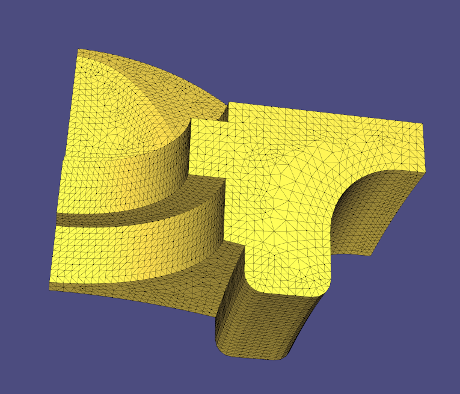

# Assignment 4

Name: 'Your real name'

Legi-Nr: 'Your legi number'

## Required results
Edit this 'README.md' file to report all your results. You only need to update the tables in the reports section by adding screenshots and reporting results.

### Mandatory Tasks

1) Screenshots of the parameterizations and textured (checkerboard) models for all the implemented methods and boundary conditions (models: cathead.obj, hemisphere.off, hemisphere_non_convex_boundary.off, Octo_cut2.obj)

2) Several examples of the distortion visualizations.

## Reports
### (mandatory-1) parameterization and checkerboard texture models
#### cathead
| Method            | checkerboard textured models          |         Parameterization             |
| :--------------:  | ------------------------------------- |------------------------------------- |
| Uniform (fixed)   ||  |
| Cotangent (fixed) ||  |
| LSCM (fixed)      ||  |
| ARAP (fixed)      ||  |
| LSCM (free)       ||  |
| ARAP (free)       ||  |

#### hemisphere
(copy the above table to format)

#### hemisphere_non_convex_boundary
(copy the above table to format)

#### Octo_cut2
(copy the above table to format)

### (mandatory-2) distortion visualization
#### cathead
| mtd \ metric      | Conformal (angle) |    Authalic (area)  |  Isometric  (length)    |
| :--------------:  | ----------------- | ------------------- | ----------------------- |
| LSCM (free)       ||  |  |
| ARAP (free) ||  | |

#### hemisphere
(copy the above table to format)

